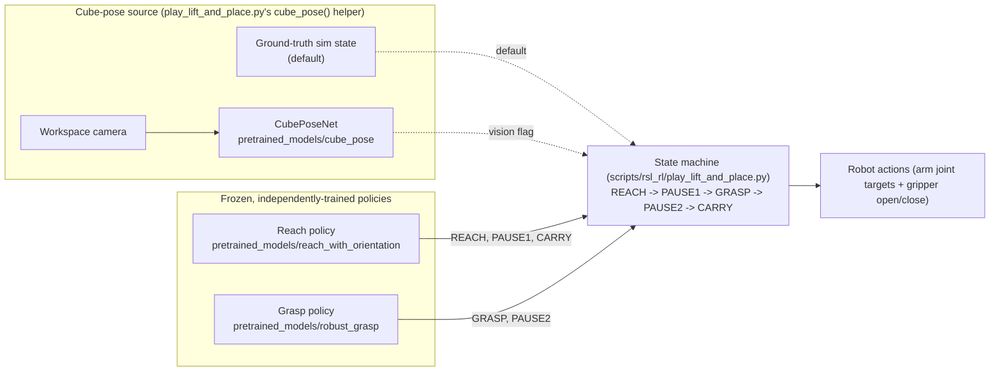
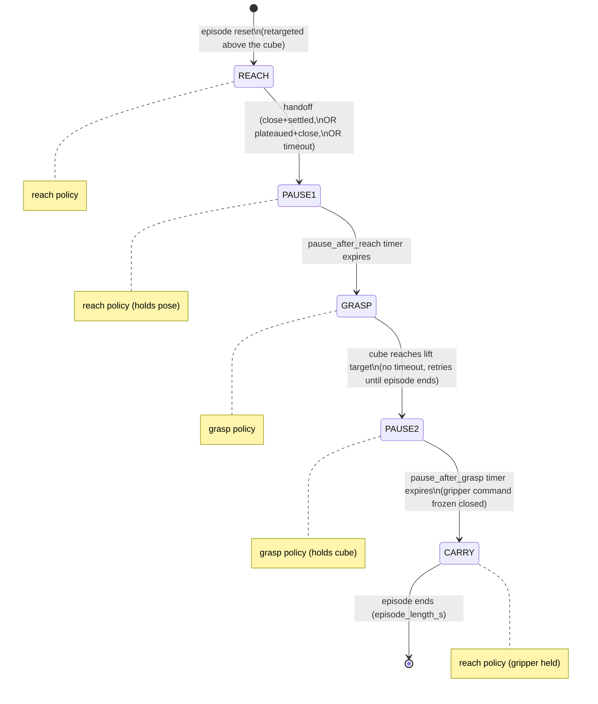

# Architecture

How the pieces fit together: the task registry, what each task actually
observes/rewards/terminates on (and what it inherits unchanged from Isaac
Lab), the pick-and-place chain's state machine, coordinate/unit conventions,
and the robot/gripper asset. See [`configuration.md`](configuration.md) for
*where* every tunable value lives, and
[`repository_structure.md`](repository_structure.md) for *where* every file
lives.

Reach and grasp are always the same two frozen checkpoints; only the
*cube-pose source* changes between the default and `--vision` runs (see
"Vision substitution" under the state-machine section below).

## Task registry

All five environments are registered under `source/gen3/gen3/tasks/manager_based/`,
auto-discovered by `gen3/tasks/__init__.py` (`isaaclab_tasks.utils.import_packages`,
which imports every `gen3_*` sub-package so their `gym.register()` calls run).

| Task ID | Config class | Algorithm(s) | Status |
|---|---|---|---|
| `Gen3-Reach-v0` | `gen3_reach.joint_pos_env_cfg.Gen3ReachEnvCfg` | RSL-RL PPO (shipped), rl_games PPO (technically registered, only tested via rl_games' own generic scripts) | Trained, shipped in `pretrained_models/reach_with_orientation/` |
| `Gen3-Grasp-v0` | `gen3_grasp.joint_pos_env_cfg.Gen3GraspEnvCfg` | RSL-RL PPO | Trained, shipped in `pretrained_models/robust_grasp/`. |
| `Gen3-LiftAndPlace-v0` | `gen3_lift_and_place.joint_pos_env_cfg.Gen3LiftAndPlaceEnvCfg` | RSL-RL PPO | **Registered and fully configured, but never trained/shipped as part of this project** — no checkpoint exists and the README never mentions it. It's a single end-to-end policy that would have to learn reach + grasp + place together; the project's actual headline result instead *chains* the two separately-trained reach and grasp policies (below). Its own PPO runner cfg docstring says as much: "Not used during chain inference." Treat it as an available-but-unused alternative approach, not a validated result. |
| `Gen3-LiftAndPlace-Chain-v0` | `gen3_lift_and_place.joint_pos_env_cfg.Gen3LiftAndPlaceChainEnvCfg` | n/a — inference-only | **This is the headline result.** Not trained directly; `play_lift_and_place.py` loads the reach and grasp checkpoints above and drives this env with a hand-written phase state machine (below). |
| `Gen3-LiftAndPlace-Chain-Vision-v0` | `gen3_lift_and_place.vision_env_cfg.Gen3LiftAndPlaceChainVisionEnvCfg` | n/a — inference-only | Same as the Chain env, but the grasp policy's two cube-pose observation terms are swapped for `CubePoseNet` predictions from the workspace camera. Used by `play_lift_and_place.py --vision`. |

## Per-task MDP: inherited vs. project-added

Both `Gen3GraspEnvCfg`/`Gen3LiftAndPlaceEnvCfg` inherit from Isaac Lab's
`LiftEnvCfg` (`isaaclab_tasks/manager_based/manipulation/lift/lift_env_cfg.py`),
and `Gen3ReachEnvCfg` inherits from `ReachEnvCfg`
(`.../manipulation/reach/reach_env_cfg.py`). Everything not listed as
"project" below is inherited from those base classes unchanged.

### `Gen3-Reach-v0`

- **Actions** (7-dim): `arm_action` — `JointPositionActionCfg` on `joint_[1-7]`,
  `scale=0.5`, `use_default_offset=True`. No gripper action — the base
  `ReachEnvCfg` doesn't define one, and this project doesn't add one; the
  gripper's joint state is instead randomized by a *reset event* (below), so
  the policy still has to cope with an open or closed gripper without
  controlling it.
- **Observations** (`policy` group, inherited from `ReachEnvCfg` **unmodified** —
  confirmed by reading the base config; this task has no observation override
  at all): `joint_pos` (noisy), `joint_vel` (noisy), `pose_command` (the
  `ee_pose` command), `actions` (last action). 4 terms, in that order — the
  chain's `_ReachPolicyObsCfg` (in `gen3_lift_and_place`) exists specifically
  to reproduce this exact layout for inference.
- **Rewards** — all 5 terms are project-overridden versions of the base ones
  (`gen3_reach/mdp/rewards.py`): position/orientation tracking are redefined
  to track the **fingertip** (`ee_frame`, +0.21 m off the wrist flange) instead
  of the flange itself, and a fine-grained *orientation* tanh term is added
  that the base `ReachEnvCfg` doesn't have at all. `action_rate`/`joint_vel`
  start at weight 0 and ramp in linearly (25%→60% of training) via a
  project-defined curriculum function, `modify_reward_weight_ramp`
  (`gen3_reach/mdp/curriculums.py`) — Isaac Lab's built-in
  `modify_reward_weight` only does a step change, not a ramp.
- **Events** (project): `reset_robot_joints` — offset reset (base uses a
  *scale* reset instead) scoped to arm joints only; `reset_gripper_state` —
  random open↔closed each reset (`reset_joints_held_uniform`, a project
  function that also sets the PD drive target so the gripper actually holds
  the sampled position); `randomize_gripper_payload` — adds 0–0.3 kg to
  `robotiq_base_link` each reset so the policy is load-robust (the shipped
  cube masses ~0.216 kg, inside this span).
- **Terminations**: inherited, `time_out` only.
- **Commands**: `ee_pose` — same x/y workspace as the base (`x∈[0.35,0.65]`,
  `y∈[-0.2,0.2]`), but roll/pitch/yaw ranges and `pos_z` are project-overridden
  (see [`configuration.md`](configuration.md) for the exact ranges and the
  orientation-convention explanation).

### `Gen3-Grasp-v0`

- **Actions** (8-dim): arm (as above) + `gripper_action` —
  `BinaryJointPositionActionCfg` on `finger_joint` (open=0.0, close=0.7).
- **Observations** (`policy` group): the base `LiftEnvCfg` 5 terms
  (`joint_pos`, `joint_vel`, `object_position`, `target_object_position` i.e.
  the `object_pose` command, `actions`) plus a project-added
  `object_orientation` term (`gen3_grasp/mdp/observations.py` — cube
  orientation as a robot-root-frame quaternion, wxyz).
- **Rewards** — heavily project-customized. The base's `reaching_object` and
  both `object_goal_tracking*` terms are **disabled** (`= None`) and replaced
  with coarse-L2 + fine-tanh pairs for both EE→cube and cube→target
  (`gen3_grasp/mdp/rewards.py`; see `configuration.md` for weights). This
  "coarse (constant gradient, non-saturating) + fine (tanh, sharp near-zero)"
  pattern is deliberate: a constant gradient means the agent is never in a
  flat reward region far from the goal, while the tanh term gives a sharp
  precision signal once close. `lifting_object` is kept but with a much lower
  weight than the base (1.0 vs. the base's 15.0) and a slightly higher
  `minimal_height` (0.05 m vs. 0.04 m) — its role here is specifically to
  break a "hover near the cube without ever grasping it" local optimum, not to
  dominate the reward. `action_rate`/`joint_vel` start at 0 and ramp in
  (project curriculum, 70% of training) — a different schedule from both the
  base and from `gen3_reach`'s.
- **Events**: the base's `reset_object_position` is **disabled**; replaced
  with `reset_above_cube_ik` (`gen3_grasp/mdp/ik_reset.py`) — places the cube
  at a random table pose and uses inverse kinematics to start the arm
  **top-down, directly above the cube**, at a varied (not canonical) joint
  configuration. This is the retrain that made the reach→grasp handoff robust
  — see the IK-reset section below.
- **Terminations**: inherited, `time_out` + `object_dropping` only. (A
  project-defined `cube_lifted_success` early-termination term existed in
  `mdp/terminations.py` but was never wired into any env config — it has been
  removed as dead code.)
- **Commands**: `object_pose` (the place target) narrowed to a low height band
  (`z∈[0.08,0.20]`) — grasp only has to lift the cube a little, not carry it
  far; the chain's carry distance is handled by the *reach* policy instead.

### `Gen3-LiftAndPlace-v0` (single end-to-end policy, unused)

Same action/observation shape as grasp, but: rewards are inherited from
`LiftEnvCfg` **unchanged** (its own docstring says so explicitly — full base
weights, no coarse/fine split, no curriculum override), object reset uses the
base's `reset_root_state_uniform` mechanism with a tighter position range plus
added yaw randomization (not IK-based), and the `object_pose` target range
is wider/higher (`z∈[0.30,0.45]`) since this task is meant to carry the cube
into the air by itself. This reads as an earlier or simpler approach that
predates the coarse/fine reward tuning and the IK-reset robustness work later
applied to `Gen3-Grasp-v0` — it was superseded, not finished.

### The IK-randomized grasp reset (`reset_above_cube_ik`)

The single most consequential piece of task-specific logic in the repo, and
the reason the reach→grasp chain works at all.

`ik_reset.py` loads its arm kinematics from a vendored URDF,
`source/gen3/gen3/assets/urdf/gen3_2f85.urdf`. Despite the gripper-suggestive
filename, only the file's *gripper* geometry is unused here
(`ik_reset.py`'s own docstring notes "the gripper is irrelevant for arm IK")
— its *arm* geometry is the sole source of kinematics for this IK solver,
FK-verified against the 2F-140 USD, and isn't duplicated anywhere else in the
repo (the robot USD itself is a binary file, not something
`pytorch_kinematics` can parse directly).

(For reference: the chain demo, `play_lift_and_place.py`, and vision data
collection, `collect_vision_data.py`, don't use this at all — the chain
environments use the ordinary `reset_object_position` event, not
`reset_above_cube_ik`.)

Building the reach→grasp *chain* required a grasp policy robust to whatever
arm configuration the reach policy hands off at — not just the one canonical
start pose the original grasp policy trained on. `gen3_grasp/mdp/ik_reset.py`:

1. Runs a batched, hand-written damped-least-squares IK solver
   (`pytorch_kinematics` + a vendored `gen3_2f85` URDF, FK-verified against the
   real 2F-140 USD) **once at startup** to build a table of ~10k valid
   `(cube_pose, arm_joint_config)` pairs — top-down gripper poses above
   randomly-sampled cube positions, at randomized-but-natural joint
   configurations.
2. Each episode reset just samples a row from that table (an index lookup +
   two state writes) — this is what keeps reset cost negligible; running IK
   live every reset measured at ~7 s/iteration and made training impractical.
3. The IK seeds *near the canonical pose* (not fully random) with a decaying
   null-space pull back toward canonical during the solve, and — among
   multiple converged seeds per target — picks the one **closest to
   canonical**. This was the key fix: fully-random seeding produced contorted
   "wrong-branch" solutions that made the arm visibly unwind at the start of
   every episode and stalled learning; canonical-biased seeding produces
   natural elbow-up starts instead.

### Reach ↔ grasp coupling

The two policies are trained independently but share several physical/timing
assumptions that make chaining them possible: identical sim timing
(`dt=1/60 s`, `decimation=2`), the same fingertip offset
(`gen3.assets.FINGERTIP_OFFSET_M = 0.21` m — see below), and reach's payload
randomization (0–0.3 kg on the gripper) covering the cube's real mass so the
same reach policy behaves correctly whether or not it's carrying the cube
during the chain's CARRY phase.

## The pick-and-place chain state machine

Implemented in `scripts/rsl_rl/play_lift_and_place.py` (and, in a
data-collection-flavored form, in `scripts/rsl_rl/vision/collect_vision_data.py`).
It is **not** part of the environment — the env just exposes both policies'
observation groups (`policy` = grasp layout, `reach` = reach layout); the
state machine lives entirely in the play script, running once per env, in
parallel across all envs as batched tensor ops.

| Phase | Active policy | Target | Exit condition | Configured in |
|---|---|---|---|---|
| `REACH` | reach | Directly above the cube, top-down, yaw snapped to the nearest cube face | Hybrid, whichever fires first: **(a)** close *and* settled (`handoff_dist`, `handoff_speed`); **(b)** converged/plateaued and reasonably close (`handoff_plateau_steps`, `handoff_plateau_eps`, `handoff_accept_dist`); **(c)** hard timeout (`reach_timeout`) | `ChainCfg` in `lift_and_place_cfg.py` |
| `PAUSE1` | reach (holds pose) | — | Timer (`pause_after_reach` seconds → control steps) | `ChainCfg.pause_after_reach` |
| `GRASP` | grasp | A point directly above the cube's current xy, at a fixed lift height | `|cube_z − grasp_lift_z| ≤ grasp_lift_tol` — **no timeout**; a grasp that never lifts just keeps retrying until the episode ends (deliberate: failures run through rather than aborting early) | `ChainCfg.grasp_lift_z`, `grasp_lift_tol` |
| `PAUSE2` | grasp (holds cube) | — | Timer (`pause_after_grasp`) | `ChainCfg.pause_after_grasp` |
| `CARRY` | reach (gripper command frozen closed from the last grasp action) | A random top-down pose sampled inside `ChainCfg.air_{x,y,z,roll,pitch,yaw}` | Episode ends (`episode_length_s`) | `ChainCfg.air_*`, `episode_length_s` |

Transitions are evaluated latest-phase-first each step (`PAUSE2`→`CARRY`
before `GRASP`→`PAUSE2` before `PAUSE1`→`GRASP` before `REACH`→`PAUSE1`) so a
phase can't be skipped within one control step. On episode reset every env
restarts at `REACH` and is retargeted above the (new) cube.

With `--vision`, the *only* difference is where "the cube's pose" comes from:
every read of it inside the state machine (the `REACH` target, the `GRASP`
lift-target's xy, and the `GRASP`→`PAUSE2` "is it lifted" check) goes through
a `cube_pose()` helper that returns `CubePoseNet`'s latest cached prediction
instead of `subtract_frame_transforms` on the simulator's ground-truth object
state. The true pose is still read, but only for diagnostics (a periodic
prediction-error printout and a per-episode "reached CARRY" success count).

## Coordinate frames and units

Verified directly from code (not assumed):
- **Robot-root frame == world origin** in every env in this repo (the robot's
  `prim_path` is always spawned with an identity transform relative to its
  env origin) — this is explicitly relied on in a few places
  (e.g. the workspace camera's `CameraCfg.offset` uses `convention="world"`
  specifically *because* that pose already equals the extrinsics in the
  robot-root frame the policies were trained on, so no extra frame conversion
  is needed at inference time).
- **Positions**: meters. **Angles**: radians.
- **Quaternions**: **wxyz** convention throughout (Isaac Lab's default) —
  e.g. `object_orientation_in_robot_root_frame`, `ee_pose`/`object_pose`
  commands, `CubePoseNet`'s output.
- **Vision model rotation representation**: `CubePoseNet` does *not* output
  quaternions directly — it outputs a continuous 6-D rotation representation
  (Zhou et al., "On the Continuity of Rotation Representations in Neural
  Networks"; the first two columns of the rotation matrix, re-orthonormalized
  via Gram-Schmidt), chosen because it has no antipodal sign ambiguity and
  regresses better than quaternions. It's converted to a wxyz quaternion
  (`quat_from_matrix`) only at the observation-term boundary, to match the
  ground-truth observation's format.
- **Camera image coordinates**: pixels, `(u, v)` with origin top-left (the
  usual image convention), used only by the (currently unused) `corners_2d`
  keypoint labels — see `configuration.md`'s camera section.

## Robot and gripper asset

Defined in `source/gen3/gen3/assets/kinova_gen3_2f140.py`:
`KINOVA_GEN3_2F140_CFG`, an `ArticulationCfg` loading the vendored USD at
`source/gen3/gen3/assets/gen3_2f140/kinova_gen3_robotiq_2f_140.usd` (Kinova Gen3 7-DoF arm
+ Robotiq 2F-140 gripper, consolidated as the repo's single robot asset).
Joint names: `joint_1`…`joint_7` (arm) and `finger_joint` (the only actuated
gripper joint — the 2F-140's other gripper joints are mimic/passive). Actuator
gains (`stiffness`/`damping`, split arm 1-4 vs. 5-7 vs. gripper) were tuned
for stable position control at `dt=1/60 s`, `decimation=2` — the same sim
timing used by all three trainable tasks. `FINGERTIP_OFFSET_M = 0.21`
(meters, along the flange's local z-axis) is defined here too, as the single
source of truth for the `ee_frame` `FrameTransformer` offset used by all
three tasks' env configs and by the grasp IK reset's `tool_offset` default.

**If you swap the gripper**, everything below is coupled to the current one
and would need to change together:
- The asset/USD itself and `KINOVA_GEN3_2F140_CFG`'s actuator block (a
  different gripper has different joints, gains, and — if it isn't a
  binary open/close gripper — a different `gripper_action` type entirely,
  not just different `open_command_expr`/`close_command_expr` values).
- `FINGERTIP_OFFSET_M` and every `ee_frame` `FrameTransformerCfg` — a
  different gripper almost certainly has a different flange-to-fingertip
  offset and possibly a different approach-axis convention.
- Anything hardcoding `finger_joint` by name: the three `gripper_action`
  configs, `test_sim/test_scene_cfg.py`'s `GRIPPER_OPEN`/`GRIPPER_CLOSE`, and
  `play_lift_and_place.py`'s binary open/close action convention
  (`action ≥ 0 → open`).
- **All three trained checkpoints become invalid.** A different gripper
  changes the action space (dimension and/or semantics) and, if the fingertip
  offset changes, every position-tracking reward/observation the policies
  were trained against — none of the shipped `.pt` files would be usable
  as-is; retraining reach and grasp from scratch would be required.

**If you swap the robot** (a different arm, not just a different gripper),
additionally: the arm joint names/count/limits in
`KINOVA_GEN3_2F140_CFG.init_state` and every `joint_names=["joint_[1-7]"]`
action-term regex, `gen3_grasp/mdp/ik_reset.py`'s `_LOWER`/`_UPPER`/`_CANONICAL`
joint limits and its vendored URDF (`assets/urdf/gen3_2f85.urdf`, used only for
IK — must be replaced or the IK reset silently solves for the wrong
kinematics), and the workspace ranges in every task's commands/events (tuned
to the Gen3's reach envelope). See
[`extending_the_project.md`](extending_the_project.md) for the same guidance
framed as a step-by-step guide.
