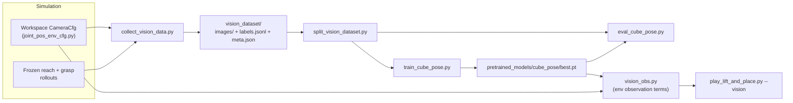

# Vision pipeline

The full flow from simulated camera to a cube-pose estimate driving the
chain, and — separately and explicitly — what would be needed to move this
to a physical camera (which this repository does **not** implement). For
per-script CLI arguments, see
[`scripts/rsl_rl/vision/README.md`](../scripts/rsl_rl/vision/README.md); this
page is the narrative/conceptual companion to that reference and to
[`running_and_reproduction.md`](running_and_reproduction.md)'s steps G–K.



## 1. The simulated camera

Defined once, in `gen3_lift_and_place/joint_pos_env_cfg.py`
(`Gen3LiftAndPlaceEnvCfg.__post_init__`, so every chain-family env has it,
whether or not `--vision` is used):

```python
self.scene.camera = CameraCfg(
    offset=CameraCfg.OffsetCfg(
        pos=(1.319, 0.0, 1.153),
        rot=(0.0, -0.436, 0.0, 0.900),   # ~50° down-tilt
        convention="world",
    ),
    spawn=sim_utils.PinholeCameraCfg(
        focal_length=24.0, focus_distance=400.0,
        horizontal_aperture=20.955, clipping_range=(0.1, 4.0),
    ),
    width=640, height=480,
)
```

Fixed, elevated, oblique view; placed beyond the cube's reachable x-range and
centered in y so the descending gripper doesn't fully occlude the cube during
grasp. `convention="world"` is deliberate: the robot root sits at the world
origin with identity rotation in every env in this repo, so this pose *is
already* the camera extrinsics in the robot-root frame the policies were
trained on — no extra conversion needed downstream. Full parameter table:
[`configuration.md`](configuration.md#camera).

## 2. Dataset collection (`collect_vision_data.py`)

Runs the same frozen reach→grasp→carry chain as `play_lift_and_place.py`
(mirroring, not sharing code with, its state machine — see
[`architecture.md`](architecture.md#the-pick-and-place-chain-state-machine)
for why they're kept structurally separate) across parallel envs, and at each
saved step writes:

- `images/NNNNNN.png` — RGB frame at the camera's **native 640×480
  resolution** (not the 320×240 `train_cube_pose.py` resizes to for
  training — these are two different, independently-configured numbers; see
  the cross-check note below).
- One `labels.jsonl` record: `file`, `env_id`, `step`, `phase`
  (`reach`/`grasp`/`carry`/...), `cube_pos` (robot-root frame, meters),
  `cube_quat_wxyz` (robot-root frame), `corners_2d` (8 cube corners in pixel
  coordinates — saved for a possible future keypoint+PnP variant; the current
  direct-regression model doesn't read this field).

Near-static `PAUSE1`/`PAUSE2` frames are subsampled 1-in-`PAUSE_SAVE_STRIDE`
so the dataset isn't dominated by duplicates; settled `CARRY` frames stop
being saved once the arm has visibly arrived (latched, to avoid a flicker of
near-duplicates right at the threshold).

### Who creates `meta.json`, and when

`collect_vision_data.py`, once per collection run, immediately after the env
is constructed — **read live off the simulated camera and env config**, never
hand-entered:

```python
meta = {
    "image_width": camera.image_shape[1],
    "image_height": camera.image_shape[0],
    "intrinsic_matrix": camera.data.intrinsic_matrices[0].cpu().tolist(),  # from the sim camera sensor itself
    "extrinsics_frame": "robot_root",
    "camera_pos": list(cam_offset.pos),        # from env_cfg.scene.camera.offset
    "camera_rot_wxyz": list(cam_offset.rot),
    "camera_convention": cam_offset.convention,
}
```

**Do not hand-edit this file.** It's a record of what the simulated camera
actually was at collection time, not a configuration input — nothing reads
it back to configure anything; it exists purely so a human (or a future
calibration step) can inspect what geometry the dataset was collected under.

## 3. Split (`split_vision_dataset.py`)

Frames are collected in rollout order — every env starts each episode in
`REACH` at the same time, so a sequential split would badly skew each split's
phase mix. The splitter shuffles first (`--seed`, default 42, for
reproducibility), then takes `--num_test` (default 1000) and `--num_val`
(default 1000) frames, remainder to train. Images are untouched; the split
files just reference the same `file` paths as `labels.jsonl`.

## 4. Training (`train_cube_pose.py`)

`CubePoseNet` — ImageNet-pretrained ResNet-18 backbone, MLP head — regresses
3-D position (meters, robot-root frame) and a continuous 6-D rotation
representation (Zhou et al.; avoids the antipodal sign ambiguity quaternions
have, so it regresses better), decoded to a rotation matrix via Gram-Schmidt
and only converted to a wxyz quaternion at the observation-term boundary (to
match the ground-truth observation's format). Frames are resized to
`--image_height`/`--image_width` (240×320 by default — **independent** of the
640×480 native collection resolution; changing one does not require changing
the other). Reports position error (cm) and geodesic rotation error (deg) on
`val` every epoch, overall and per phase; saves `best.pt` by validation
position error. No Isaac Sim dependency — plain PyTorch/torchvision, can run
on any machine with the dataset copied over.

## 5. Evaluation (`eval_cube_pose.py`)

Loads a checkpoint, reports the same position/rotation metrics on one split
— defaults to `test` (never used for training or checkpoint selection, so
it's the honest final number). This is where the README's
**0.50 cm / 1.2°** headline figures come from.

## 6. Integration into the chain

`gen3_lift_and_place/vision_env_cfg.py`'s `Gen3LiftAndPlaceChainVisionEnvCfg`
swaps two observation terms — `object_position`/`object_orientation` — for
`mdp.object_position_from_vision`/`mdp.object_orientation_from_vision`
(`gen3_lift_and_place/mdp/vision_obs.py`). Reassigning the *existing* term
names keeps the grasp policy's observation vector layout unchanged (position
in the vector, dimensionality) — only the *source* of those numbers changes,
which is exactly why the frozen grasp checkpoint still works unmodified: it
cannot tell the difference between a ground-truth number and a predicted one
in the same slot.

`vision_obs.py` runs one `CubePoseNet` forward pass per env step (cached by
`env.common_step_counter` so both swapped terms reuse the same inference),
and also leaves the prediction on `env._vision_pose_cache` — this is what
`play_lift_and_place.py --vision`'s state machine reads for the `REACH`
target, the `GRASP` lift-target, and the `GRASP`→`PAUSE2` "is it lifted"
check. The *true* cube pose is still read in this mode, but only for
diagnostics (a periodic prediction-error printout and a per-episode
"reached CARRY" success count) — it never feeds back into control.

## Three-way consistency check (resolution)

Cross-checked directly against code, not assumed:

| Claim | Source | Value |
|---|---|---|
| Camera capture resolution | `CameraCfg(width=640, height=480)` | 640×480 |
| What the collector saves | `collect_vision_data.py`'s `Image.fromarray(rgb[env_id]...)`, no resize | 640×480 (matches camera) |
| What the network trains on | `train_cube_pose.py --image_height/--image_width` defaults | 240×320 (resized at load time, independent knob) |

These are consistent (the training-time resize is an intentional, documented
downsampling step, not a mismatch) — but they are three independently
specified numbers, not one shared constant, so changing the camera's
`width`/`height` does **not** need any corresponding change to
`train_cube_pose.py`'s resize args (the dataset just gets recollected at the
new native resolution, and training resizes from whatever that is), while
changing the *training* resize args alone needs no camera change at all.

## Moving to a physical camera — what's implemented vs. what isn't

**Implemented today**: the entire pipeline above, entirely in simulation.
`meta.json`'s intrinsics/extrinsics come *only* from the simulated
`CameraCfg` — there is no calibration routine anywhere in this repository
(no `cv2.calibrateCamera` equivalent, no checkerboard/AprilTag capture, no
extrinsic solve against the robot base). `CubePoseNet` has only ever seen
rendered simulation frames.

**What a physical camera would require** (none of this exists yet):

1. **Intrinsic calibration** — a real focal length/principal-point/distortion
   model for the actual physical camera (checkerboard or similar), replacing
   the simulated `PinholeCameraCfg`'s idealized, distortion-free model.
2. **Extrinsic calibration** — the physical camera's pose *relative to the
   real robot's base frame*, which must be measured (e.g. hand-eye
   calibration, or a fixed rig with known geometry), replacing the
   hand-authored `CameraCfg.offset` used in sim.
3. **Resolution/preprocessing compatibility** — whatever resolution the real
   camera captures at must go through the same resize/normalize pipeline
   `CubePoseNet` expects (`train_cube_pose.py`'s `IMAGENET_MEAN`/`STD`
   normalization and the configured `image_height`/`image_width`); this is
   mechanically easy but must be done consistently at inference time too
   (`vision_obs.py`'s preprocessing would need the same treatment as a real
   camera source).
4. **Domain shift / retraining** — `CubePoseNet` was trained exclusively on
   rendered frames (synthetic lighting, textures, no sensor noise). Real
   camera images differ enough from that distribution that direct transfer is
   unlikely to hold; fine-tuning or retraining on real (or domain-randomized)
   images should be expected, not assumed unnecessary.

Nothing in this repository claims sim-to-real vision is solved — the
project's own [report](../report/kinova_project_report.pdf) frames it as
future work, consistent with the above.
